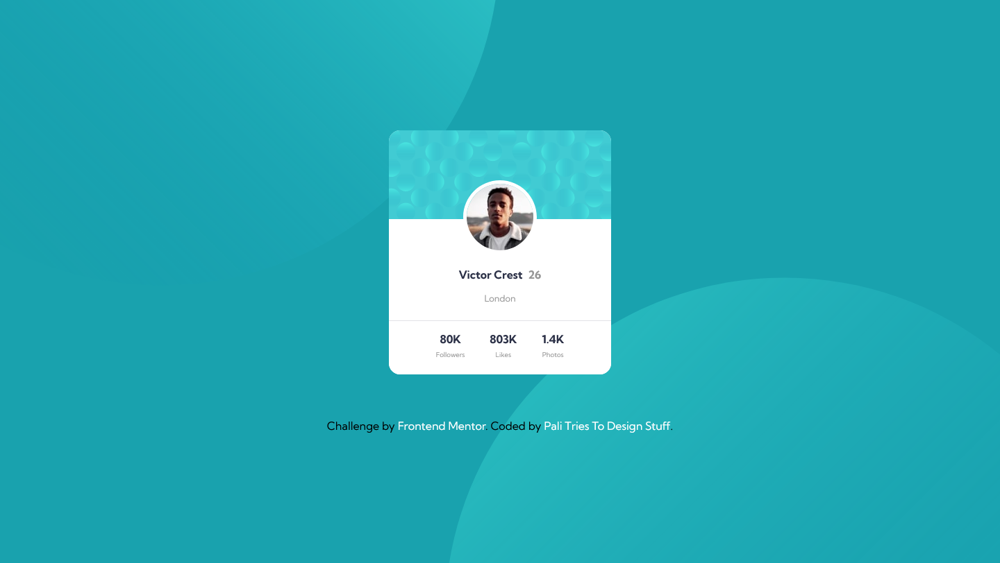

# Frontend Mentor - Profile card component solution

This is a solution to the [Profile card component challenge on Frontend Mentor](https://www.frontendmentor.io/challenges/profile-card-component-cfArpWshJ). Frontend Mentor challenges help you improve your coding skills by building realistic projects.

## Table of contents

- [Overview](#overview)
  - [The challenge](#the-challenge)
  - [Screenshot](#screenshot)
  - [Links](#links)
- [My process](#my-process)
  - [Built with](#built-with)
  - [What I learned](#what-i-learned)
- [Author](#author)

## Overview

### The challenge

- Build out the project to the designs provided

### Screenshot




### Links

- Solution URL: https://fancy-melba-312ae4.netlify.app/

## My process

### Built with

- Semantic HTML5 markup
- Mobile-first workflow

### What I learned

```css
body {
  background-image: url(/images/bg-pattern-top.svg),
    url(/images/bg-pattern-bottom.svg);
  background-position: right 12rem bottom 25rem, left 12rem top 25rem;
}
```

## Author

- Frontend Mentor - [@PaliTriesToDesign](https://www.frontendmentor.io/profile/PaliTriesToDesign)
- Twitter - [@PT2DS](https://www.twitter.com/PT2DS)

*
