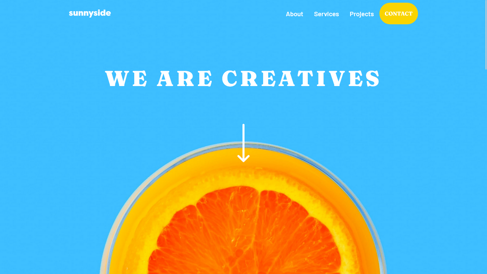
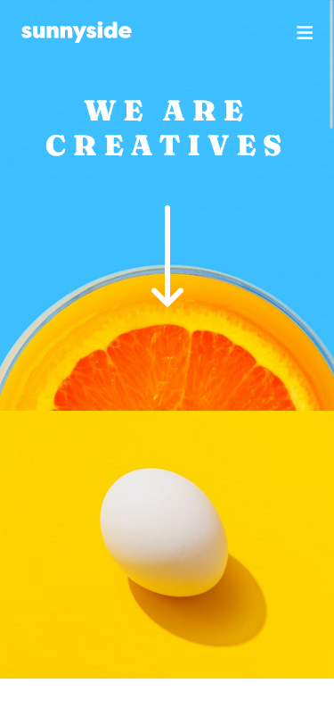

# Frontend Mentor - Sunnyside agency landing page solution

This is a solution to the [Sunnyside agency landing page challenge on Frontend Mentor](https://www.frontendmentor.io/challenges/sunnyside-agency-landing-page-7yVs3B6ef). Frontend Mentor challenges help you improve your coding skills by building realistic projects.

## Table of contents

- [Overview](#overview)
  - [The challenge](#the-challenge)
  - [Screenshot](#screenshot)
  - [Links](#links)
- [My process](#my-process)
  - [Built with](#built-with)
  - [What I learned](#what-i-learned)
  - [Continued development](#continued-development)
  - [Useful resources](#useful-resources)
- [Author](#author)
- [Acknowledgments](#acknowledgments)

## Overview

### The challenge

Users should be able to:

- View the optimal layout for the site depending on their device's screen size
- See hover states for all interactive elements on the page

### Screenshots




### Links

- Live Site URL: https://fastidious-pika-d70b3c.netlify.app/

## My process

### Built with

- Semantic HTML5 markup
- CSS custom properties
- Flexbox
- CSS Grid
- Mobile-first workflow

### What I learned

```html
<nav class="nav-menu">
  
  <i class="fa-solid fa-bars" id="bars-menu"></i>

  <div id="desktop-menu">
    <ul class="desktop-list">
      <li>About</li>
      <li>Services</li>
      <li>Projects</li>
      <button class="desktop-button">CONTACT</button>
    </ul>
  </div>
</nav>

<div class="hidden" id="mobile-menu">
  <ul class="menu-list">
    <li>About</li>
    <li>Services</li>
    <li>Projects</li>
    <button class="mobile-button">CONTACT</button>
  </ul>
</div>
```

```css
#mobile-menu::after {
  content: "";
  width: 0;
  height: 0;
  border-left: 40px solid transparent;
  border-right: 40px solid transparent;

  border-bottom: 40px solid var(--white);
  display: block;
  transform: rotate(135deg);
  position: absolute;
  top: 0;
  right: -8.2%;
}

.transform-link,
.stand-out-link {
  position: relative;
}

.transform-link::before,
.stand-out-link::before {
  content: "";
  display: block;
  background-color: var(--primary-yellow);
  border-radius: 8px;
  width: 130px;
  height: 8px;
  top: 65%;
  left: 50%;
  transform: translateX(-50%);
  position: absolute;
  opacity: 0.5;
  z-index: -1;
}

.stand-out-link::before {
  background-color: var(--primary-red);
}

.transform-link:hover::before,
.stand-out-link:hover::before {
  opacity: 1;
  transition: all 100ms ease-in-out;
}
```

## Author

- Frontend Mentor - [@yourusername](https://www.frontendmentor.io/profile/PaliTriesToDesign)
- Twitter - [@PT2DS](https://www.twitter.com/PT2DS)
